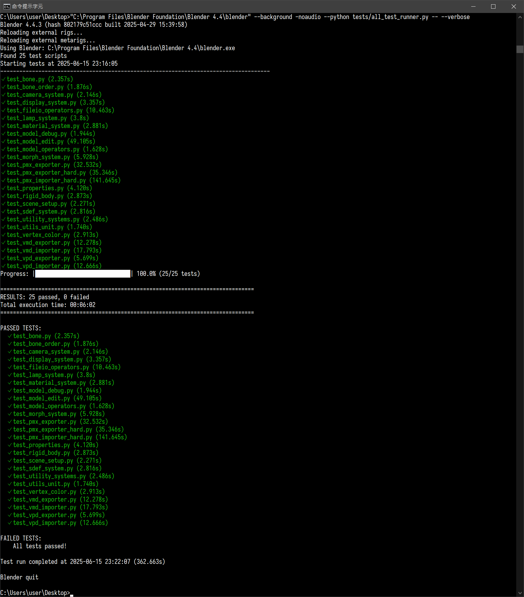

# Test Runner

## Running All Tests

The test runner supports three launch methods:

```text
# Method 1: From Blender
blender --background -noaudio --python tests/all_test_runner.py -- --verbose

# Method 2: With Python (using PATH)
python all_test_runner.py

# Method 3: With Python (explicit path)
python all_test_runner.py "C:\Program Files\Blender Foundation\Blender 4.4\blender.exe"
```

### Expected Output

When all tests pass successfully, you should see output similar to this:



If any tests FAIL, run the individual test file to see detailed error information.

## Running Individual Tests

Run individual test scripts directly:

```text
blender --background -noaudio --python tests/test_pmx_exporter.py -- --verbose
blender --background -noaudio --python tests/test_vmd_exporter.py -- --verbose
...
```

## Available Test Scripts

Check the tests folder in the repo.

## PMX Test Limitations

PMX tests may fail under the following circumstances, which are considered normal behavior:

1. **Model has no name** - Models without proper naming will not pass PMX export/import tests
2. **Morph ordering mismatch** - Model morphs that are not sorted according to MMD Tools export behavior will cause test failures
3. **NaN parameters in model data** - Models containing NaN (Not a Number) values in bone parameters, rigid body parameters, or other numerical data may fail tests.

If you encounter test failures due to these conditions, please verify your model.

## Test Coverage

```text
C:.
|   ✓ auto_load.py (test_utility_systems.py)
|   ✓ auto_scene_setup.py (test_scene_setup.py)
|   - blender_manifest.toml
|   ✓ bpyutils.py (test_utility_systems.py)
|   ✓ cycles_converter.py (test_utility_systems.py)
|   ✓ handlers.py (test_utility_systems.py)
|   ✗ m17n.py
|   ✗ menus.py
|   ✗ preferences.py
|   ✗ translations.py
|   ✓ utils.py (test_utils_unit.py)
|   - __init__.py
|
+---core
|   |   ✓ bone.py (test_bone.py)
|   |   ✓ camera.py (test_camera_system.py)
|   |   ✓ exceptions.py (test_utility_systems.py)
|   |   ✓ lamp.py (test_lamp_system.py)
|   |   ✓ material.py (test_material_system.py)
|   |   ✓ model.py (used in multiple test files)
|   |   ✓ morph.py (test_morph_system.py)
|   |   ✓ rigid_body.py (test_rigid_body.py)
|   |   ✓ sdef.py (test_sdef_system.py)
|   |   ✓ shader.py (test_material_system.py)
|   |   ✗ translations.py
|   |   - __init__.py
|   |
|   +---pmd
|   |       ✓ importer.py (used in test_pmx_exporter.py)
|   |       - __init__.py
|   |
|   +---pmx
|   |       ✓ exporter.py (test_pmx_exporter.py, test_pmx_exporter_hard.py)
|   |       ✓ importer.py (test_pmx_importer_hard.py, multiple test files)
|   |       - __init__.py
|   |
|   +---vmd
|   |       ✓ exporter.py (test_vmd_exporter.py)
|   |       ✓ importer.py (test_vmd_importer.py)
|   |       - __init__.py
|   |
|   \---vpd
|           ✓ exporter.py (test_vpd_exporter.py)
|           ✓ importer.py (test_vpd_importer.py)
|           - __init__.py
|
+---operators
|       ✓ animation.py (test_animation.py)
|       ✓ camera.py (test_camera_system.py)
|       ✓ display_item.py (test_display_system.py)
|       ✓ fileio.py (test_fileio_operators.py)
|       ✓ lamp.py (test_lamp_system.py)
|       ✓ material.py (test_material_system.py)
|       ✓ misc.py (test_misc.py)
|       ✓ model.py (test_model_operators.py)
|       ✓ model_edit.py (test_model_edit.py)
|       ✓ model_validation.py (test_model_debug.py)
|       ✓ morph.py (test_morph_system.py)
|       ✓ rigid_body.py (test_rigid_body.py)
|       ✓ sdef.py (test_sdef_system.py)
|       ✗ translations.py
|       ✗ view.py
|       - __init__.py
|
+---panels
|   |   ✓ prop_bone.py (test_bone.py)
|   |   ✓ prop_camera.py (test_camera_system.py)
|   |   ✓ prop_lamp.py (test_lamp_system.py)
|   |   ✓ prop_material.py (test_material_system.py)
|   |   ✗ prop_object.py
|   |   ✗ prop_physics.py
|   |   ✗ shading.py
|   |   - __init__.py
|   |
|   \---sidebar
|           ✓ bone_order.py (test_bone_order.py)
|           ✓ display_panel.py (test_display_system.py)
|           ✗ joints.py
|           ✓ material_sorter.py (test_model_management.py)
|           ✓ meshes_sorter.py (test_model_management.py)
|           ✓ model_debug.py (test_model_management.py)
|           ✓ model_production.py (test_model_management.py)
|           ✓ model_setup.py (test_model_management.py)
|           ✓ morph_tools.py (test_morph_system.py)
|           ✗ rigid_bodies.py
|           ✓ scene_setup.py (test_scene_setup.py)
|           - __init__.py
|
+---properties
|       ✓ camera.py (test_properties.py)
|       ✓ material.py (test_properties.py)
|       ✓ morph.py (test_properties.py)
|       ✓ pose_bone.py (test_properties.py)
|       ✓ rigid_body.py (test_properties.py)
|       ✓ root.py (test_properties.py)
|       ✓ translations.py (test_properties.py)
|       - __init__.py
|
\---typings
    \---mmd_tools
        \---properties
                - material.pyi
                - morph.pyi
                - pose_bone.pyi
                - root.pyi
                - translations.pyi
```
